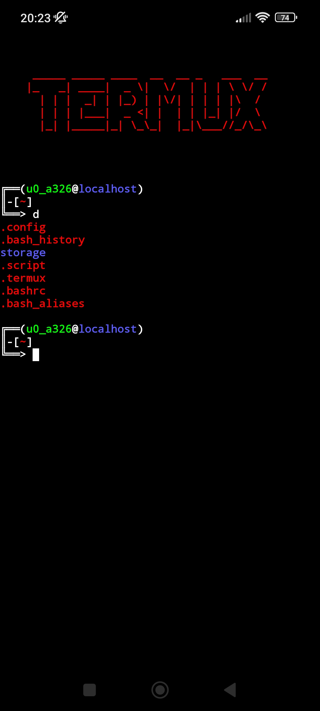

Esta pasta contém configurações personalizadas para o **Termux**, um poderoso emulador de terminal para Android. Aqui você encontrará arquivos como `.bashrc`, `.bash_aliases` e scripts úteis para otimizar sua experiência no **Termux**.



---

## Instalação


**Clone o repositório, certifique-se de ter clonado este repositório**

```bash
	cd termux
	
	chmod +x termux.sh
	
	source termux.sh -i

	source termux.sh -u
```