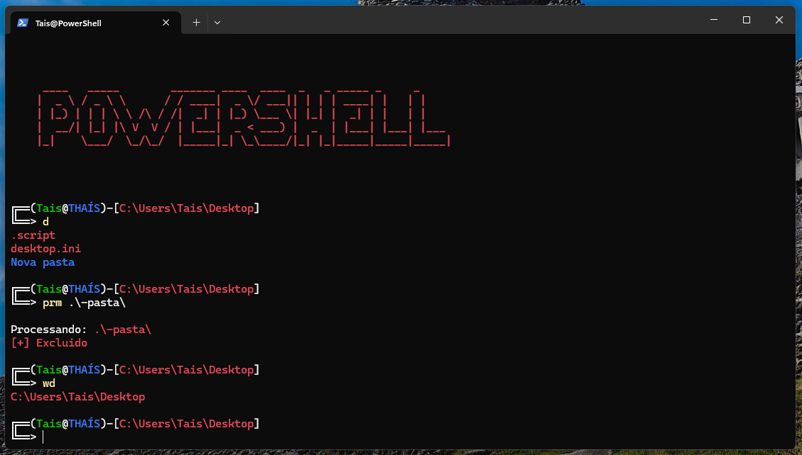

Esta pasta contém configurações personalizadas: **CMD** e **PowerShell** para **Windows** e scripts úteis para melhorar sua experiência.

## Instalação

#### **Executar o CMD ou PowerShell como administrador**

**Clone o repositório, certifique-se de ter clonado este repositório**

**Abra a pasta win**

**Cmd ou PS, execute uma vez, para juntar as partes do arquivo mingw64.tar.gz**

   🔹 **CMD:**  
```
copy /b mingw64.tar.gz.partaa + mingw64.tar.gz.partab + mingw64.tar.gz.partac + mingw64.tar.gz.partad mingw64.tar.gz
```
   🔹 **PS:**  
```
Get-Content mingw64.tar.gz.partaa, mingw64.tar.gz.partab, mingw64.tar.gz.partac, mingw64.tar.gz.partad -ReadCount 0 -Encoding Byte | Set-Content mingw64.tar.gz -Encoding Byte
```

## **CMD**


---

```bash
	cmd.bat -i
	
	cmd.bat -u
```
**Prompt de Comando (CMD)** para iniciar automaticamente com um script personalizado

## 🔹 **Abrir o Local do CMD**  
**Pesquise** no **Menu Iniciar**:  
   - Digite **Prompt de Comando** ou **cmd**.  
**Clique com o botão direito** sobre o **Prompt de Comando**.  
**Selecione** ➝ **Abrir local do arquivo**.  

---

No local onde foi aberto, **clique com o botão direito** no atalho do **Prompt de Comando**.  
**Escolha** ➝ **Propriedades**.  

---

## 🔹 **Modificar o Destino do CMD**  
**Na aba "Atalho"**, localize o campo **Destino**.  
Substitua o conteúdo atual por um dos seguintes comandos:  

   🔹 **Opção 1:**  
```
%windir%\system32\cmd.exe /K %userprofile%/Desktop/.script/cmd.bat
```
   🔹 **Opção 2:**  
```
%COMSPEC% /K %userprofile%/Desktop/.script/cmd.bat
```

## **PowerShell**



---

**Abra a pasta win**

```bash
	.\ps.ps1 -i
	
	.\ps.ps1 -u
```

---

## Como adicionar o MinGW (C/C++) ao PATH no Windows

**Acesse as Variáveis de Ambiente**:

	Pesquise por "variáveis de ambiente" no Menu Iniciar
	Selecione "Editar as variáveis de ambiente do sistema"

**Edite o PATH**:

	Na janela de Variáveis de Ambiente:

		Clique em "Path" na seção "Variáveis do sistema"
		Clique em "Editar..."
		Clique em "Novo"
		Cole: C:\mingw64\bin
		Clique em "OK" em todas as janelas abertas

**Verifique a instalação**:

	Abra um novo terminal (CMD/PowerShell)
	
	Execute:

```bash
	gcc --version
	
	g++ --version
```
	Deve mostrar a versão instalada

**Reinicie o terminal após alterar o PATH**